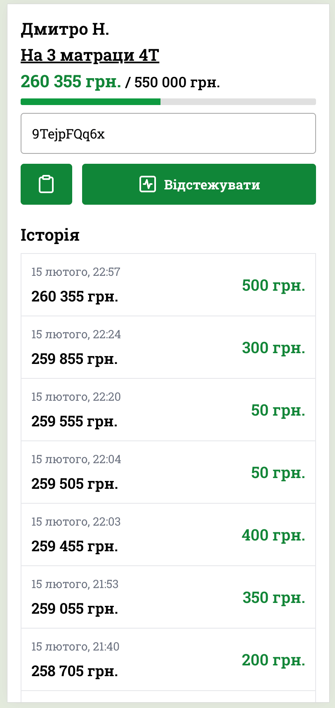

# Jar Tracker

A web application for tracking balance changes in Monobank jars (fundraising campaigns).

**Link:** [https://jar.vdovareize.me](https://jar.vdovareize.me)

## Overview

Jar Tracker is a monitoring tool designed to track and visualize the donation dynamics of Monobank charity jars. Monobank is a popular Ukrainian digital bank that provides a feature for creating fundraising jars (банки) for various charitable causes. This application allows users to monitor how these jar balances change over time, providing insights into donation patterns and campaign progress.

## Features

- **Real-time Balance Tracking**: Monitor the balance changes of any public Monobank jar
- **Historical Data Visualization**: View donation dynamics and trends over time
- **Simple Interface**: Easy-to-use interface requiring only a jar ID or URL
- **Public Jar Support**: Track any publicly accessible Monobank fundraising jar

## How to Use

1. **Open the Application**: Navigate to [https://jar.vdovareize.me](https://jar.vdovareize.me)
2. **Enter Jar Information**: In the main input field, enter either:
   - The Monobank jar ID, or
   - The full URL to the Monobank jar
3. **Start Tracking**: The application will begin monitoring balance changes for the specified jar

### Example

*Example of tracking a Monobank jar showing real-time balance updates and donation history*

## Technical Stack

### Backend
- **Framework**: NestJS - A progressive Node.js framework for building efficient and scalable server-side applications
- **Database**: PostgreSQL - Robust relational database for storing jar tracking data
- **ORM**: Prisma - Next-generation ORM for type-safe database access
- **Deployment**: Vercel - Serverless deployment platform for the API server

### Caching Layer
- **Service**: Upstash - Redis-compatible caching using a cascade of Upstash profiles for optimized performance

### Background Jobs
- **Cron Jobs**: Custom script deployed separately on Render.com for scheduled balance checking and data updates

### Architecture
The application uses a distributed architecture to leverage free-tier resources:
- Main API server hosted on Vercel
- Separate cron job service on Render.com for periodic balance updates
- Upstash Redis for caching to minimize database queries and API calls
- PostgreSQL database for persistent storage of historical balance data

## Limitations

This project is built entirely on free-tier resources, which introduces several constraints:

1. **Not Real-time**: Balance updates are not 100% live due to polling delays and free-tier limitations. There is a delay between actual donations and when they appear in the tracker.

2. **Not Suitable for High-Traffic Jars**: As a consequence of the polling delay, this application is not ideal for tracking extremely popular or highly active fundraising jars where donations occur very frequently.

3. **No Cross-Device Synchronization**: Visualization changes and user preferences are not synchronized across different devices. Each device maintains its own local state.

## Use Cases

- **Campaign Organizers**: Monitor the progress of your fundraising campaigns
- **Donors**: Track the impact of charitable initiatives you support
- **Analysts**: Study donation patterns and campaign effectiveness
- **Transparency**: Provide public visibility into fundraising progress

## Contributing

Contributions are welcome! Please feel free to submit issues or pull requests.

## Acknowledgments

Built with ❤️ for the Ukrainian community to support transparency in charitable fundraising.